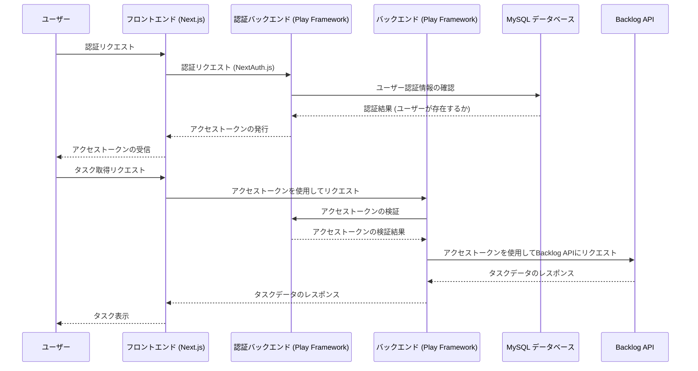

- BacklogApiはAPI Keyで行う。  
[参考資料](https://developer.nulab.com/ja/docs/backlog/auth/)


```sh
docker build -t db ./database/.
docker run --name db-container -p 3306:3306 -d db
```

```sh
# コンテナを停止
docker stop db-container
# コンテナを削除
docker rm db-container
# イメージを削除
docker rmi db
```