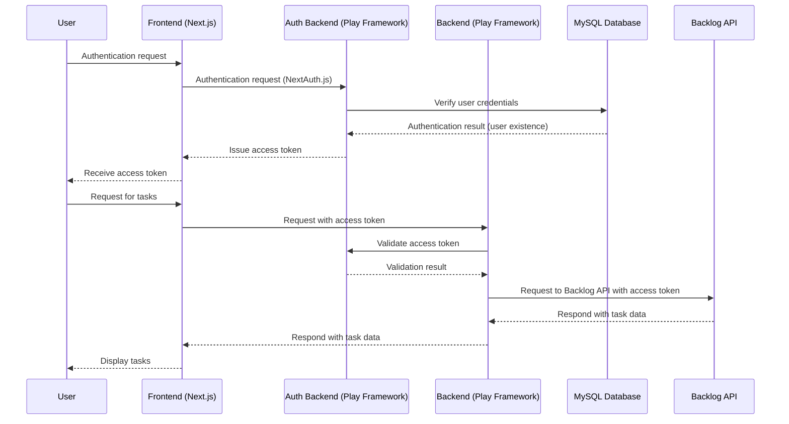

# What's this Repository?

"I’ve written this freely, so it may lack coherence."  
This repository is a quick implementation of the technologies I’m currently interested in.  
The architecture and programming languages may change from time to time.

## Project Overview

This project is a fully integrated system built from the backend to the frontend. The backend is developed using Scala and Play Framework, handling user authentication and database operations. The frontend is built with Next.js and NextAuth, providing the user interface and authentication flow. MySQL is used for the database, and Docker is utilized for containerization.

The system authenticates users through an authentication backend and provides task data to authenticated users. Future plans include adding more APIs, improving the frontend design, and deploying the system on Kubernetes.

## Installation Instructions

```sh
git clone <this repository URL>
cd <repository directory>
docker compose up --build
```
The credentials for authentication are:

- ID: admin
- Password: password123


### Summary of the Structure



- The Backlog API uses an API Key for authentication.  
  [Reference](https://developer.nulab.com/ja/docs/backlog/auth/)

## Explanation of the Technologies Used:
- **Frontend**: Next.js, NextAuth
- **Backend**: Scala, Play Framework
- **Database**: MySQL
- **Docker**

In the future, I plan to deploy this on Kubernetes.

## Future Plans
- **Backend**: I plan to add more APIs and implement phantom tokens.
- **Frontend**: I aim to improve the design for a cleaner look.

## Docker Commands

- **Start the Database**
  ```sh
  docker build -t db ./database/.
  docker run --name db-container -p 3306:3306 -d db

- Stop and Clean Up Docker

```sh
# Stop the container
docker stop db-container
# Remove the container
docker rm db-container
# Remove the image
docker rmi db
```

