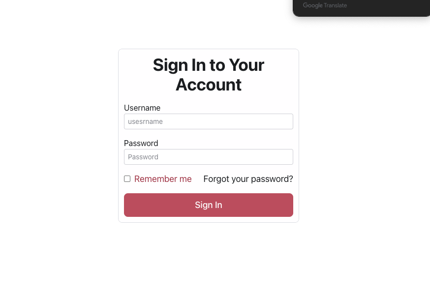

# 


```sh
cd minikube
docker login # DockerHubのパブリックなものを取得してくるため
kubectl apply -f <ここにあるyamlすべてアプライしてください。>
# ingreessの有効化
minikube addons enable ingress
kubectl apply -f ingress.yaml
kubectl apply -f ingress-service.yaml

```
```sh
vim /etc/hosts
# 以下を追加
# 127.0.0.1 frontend.minikube.local
```

[デプロイ先](http://frontend.minikube.local)

デプロイ先にアクセスができると以下のページが出てきます。


成功している時のアクセスの仕方
```sh
# frontend pod へのアクセス
kubectl port-forward svc/frontend 3000:3000

# backend pod へのアクセス
kubectl port-forward svc/backend  9000:9000

# database pod へのアクセス
kubectl port-forward svc/db  3306:3306
```
